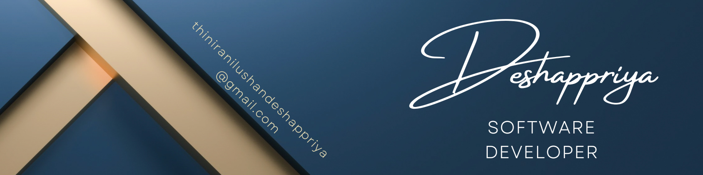

<h1 align="center">Hi, I'm Thinira Nilushan Deshappriya   < Mr . No-Hat /></h1>

###
###

<h2 align="center">A passionate Software Engineering student from Sri Lanka.</h2>

###

  

###

<h4 align="left">🌱 I’m currently learning Frontend & Backend Development Specially MERN Stack.  👯 I’m looking to collaborate on React Js Library.  🤝 I’m looking for help with Frontend & Backend Design.  👨‍💻 All of my projects are available @tn-deshappriya  💬 Ask me about React Js & React Native🙂👍  📫 How to reach me thiniranilushandeshappriya@gmail.com And www.linkedin.com/in/thinira-nilushan-deshappriya-302721309  ⚡ Fun fact Programmers are two types, Red-Hat & White-Hat ...   but I don't have Hat so, I'm No-Hat 😁</h4>

###

<h3 align="center">Social Media</h3>

###

  
  
  
  
  
  
  

###

<h3 align="center">My Skills</h3>

###

  
  
  
  
  
  
  
  
  
  
  
  
  
  
  
  
  
  
  
  
  
  
  
  
  
  
  
  
  
  
  
  
  
  
  
  
  
  
  
  
  
  
  
  
  
  
  
  
  
  
  
  
  
  
  
  
  
  
  
  
  
  
  
  
  
  
  

###

<h3 align="center">My Progress</h3>

###

  
  

###

<!---
tn-deshappriya/tn-deshappriya is a ✨ special ✨ repository because its `README.md` (this file) appears on your GitHub profile.
You can click the Preview link to take a look at your changes.
--->
